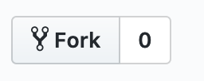
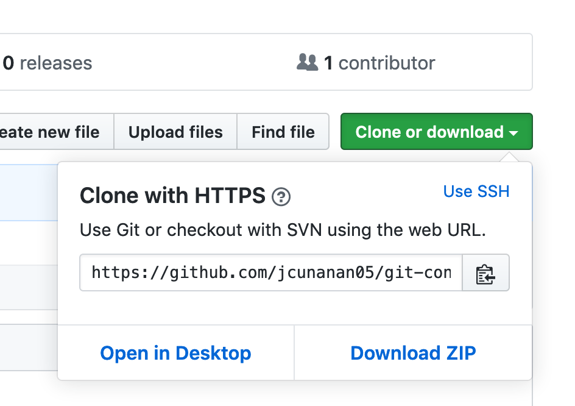

# Git Triangular Workflow Basics

_image credits to https://github.blog/wp-content/uploads/2015/07/5dcdcae4-354a-11e5-9f82-915914fad4f7.png?fit=2000%2C951_

New to contributing to open-source? No problem. We're going to go through crash course on how to contribute nice and clean to open-source repositories using what people call _triangular workflow_. Particularly in Github. Let's go!

## TLDR;

- `git clone` the github repository you want to contribute to
- Fork the repository
- Copy your forked repo github repository URL
- On your cloned repo, run `git remote set-url --push origin ${YOUR_FORKED_REPO_URL}`
- You're now set for triangular workflow. Leave the author's development branch untouched.
- On the development branch, run `git checkout -b branchNameWhereYouCode` to switch in a branch you can work on.
- Commit your changes by running `git commit`
- Before you submit your pull request, _checkout_ to master/development branch and run `git pull`. This will pull the changes that is made on the original author's develoment branch.
- Checkout on your the branch you're working on, and run `git rebase development`. If there are code conflicts, fix the code conflicts, and save the file. Run `git rebase --continue` to proceed.
- run `git push --set-upstream origin branchWhereYouCode` This will set a new branch on your forked github repository
- Now submit a pull request on the author's development branch from the branch where you code.
- Wait to be approved. Congrats!

## What is triangular workflow?

Triangular workflow is a process that you push changes on your copy of the repository (fork), but you pull (get updates) from the original repository. In that way, we will prevent code conflicts when contributing to the repository.

## Git Crash Course

To be able to contribute to other repositories in Github, you don't need to be a git-fu master. You can even contribute to this repository! But before getting started, you need at least to familiarize yourself with these terms or commands.

### `git clone repositoryUrl`

Cloning means you're downloading the codes from the original source to your computer (local machine).

### Fork

Fork button on github

Forking is making a copy of the original source code on your account. Because the user has the original codebase, you can't push code without the user's approval. We need to fork the repository to make our own changes.

### git checkout

Checkout is to switch to a new branch, a separate timeline.

### Remote

The url where our code lives in the internet. For our demo, it's on Github.

### Push / Pull

Uploading or downloading code changes from a remote.

### Pull Request

This is you, the contributor, requesting code changes from the maintainer's or author's soure code.

### Conflicts

Code changes that happens on the same file that confuses git which to accept, so the user needs to manually change files and save, and commit again.

### Rebase

This is a git command to fix or clean your timelines (or commits). It has many uses, but for our tutorial, this is used so we have a clean and updated timeline when we submit a pull request.

### Commit

Think of commit as you're making a save point of your progress, and you can come back to that save point later.

Ok, we're all set. Let's go the tutorial on how to make a clean timeline pull request.

## Tutorial

### Setup

First things first, you need to setup your git and github account. This will be another topic, but here's a good tutorial about [how to setup your git and github](https://kbroman.org/github_tutorial/pages/first_time.html).

Next, we need to find a repository to contribute to. In this tutorial, you can go to [this tutorial's repository.](https://github.com/jcunanan05/git-contributing-basics)

We need to clone the repository. At the right side of the screen, you need to click that green button that says _Clone or Download_, and copy the url there.

